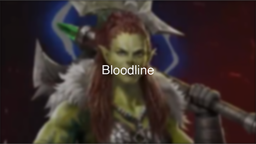
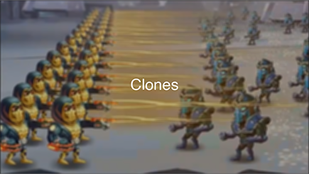
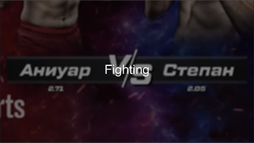
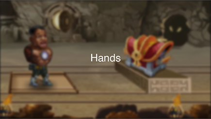
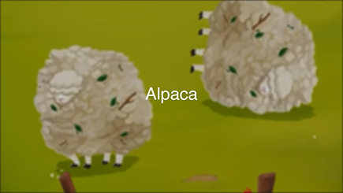
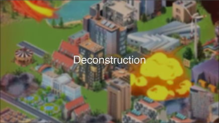
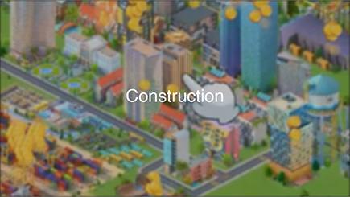
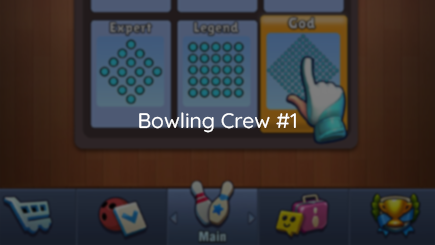

# Hello recruiters! I am Andrew Somov, a Middle Motion Designer and 2D Animator.

---

### Contents:

&#x2022; <a href="#-about-me">About me</a>
 &#x2022; <a href="#-links">Links</a>
 &#x2022; <a href="#-software">Software</a>
 &#x2022; <a href="#-portfolio">Portfolio</a>
 &#x2022; <a href="#-cv">CV</a>

---

### 😊 About me:

Motion Designer with over 5 years of experience specializing in 2D animation and expanding into 3D to drive user engagement and brand alignment across digital sectors, including Mobile Gaming. Known for delivering high-quality, visually impactful content with meticulous attention to detail and strong collaborative skills within international teams. Proficient in Adobe After Effects, Premiere Pro, Unity, Spine 2D, and developing expertise with Blender, Unreal Engine, and AI tools for content creation. Skilled in creating engaging and brand-consistent animations that contribute to enhanced user acquisition, brand visibility, and campaign effectiveness.

Portfolio: https://thesomov.com/portfolio/ 
Behance: https://www.behance.net/andrewsomov 
GitHub: https://github.com/AndrewSomov

Technical Skills: 
- Advanced: Adobe After Effects, Spine 2D, Premiere Pro, Unity, Photoshop, Illustrator 
- Developing: Blender, Unreal Engine (3D Animation Basics), Cinema 4D 
- Additional: Sound Design, AI Tools (Midjourney, Stable Diffusion, Kaiber)

Core Skills: 
- Motion Graphics 
- 2D & 3D Animation 
- Video Editing & Production 
- Video Quality & Sound Synchronization 
- Brand Consistency & Visual Storytelling 
- Creative Collaboration & Cross-Platform Integration 
- Project Management & Team Collaboration 
- Adaptability in Fast-Paced Environments 
- Attention to Detail 
- Innovative Content Creation & Ideation

Feel free to reach out via email at <a href="mailto:motion.designer@thesomov.com">motion.designer@thesomov.com</a>

---

### 🤝 Links:

   

---

### 👨‍💻 Software:

⠀⠀⠀⠀</a> <a href="https://esotericsoftware.com/">

---

### 💼 Portfolio:

---

### 👔 CV:
 

